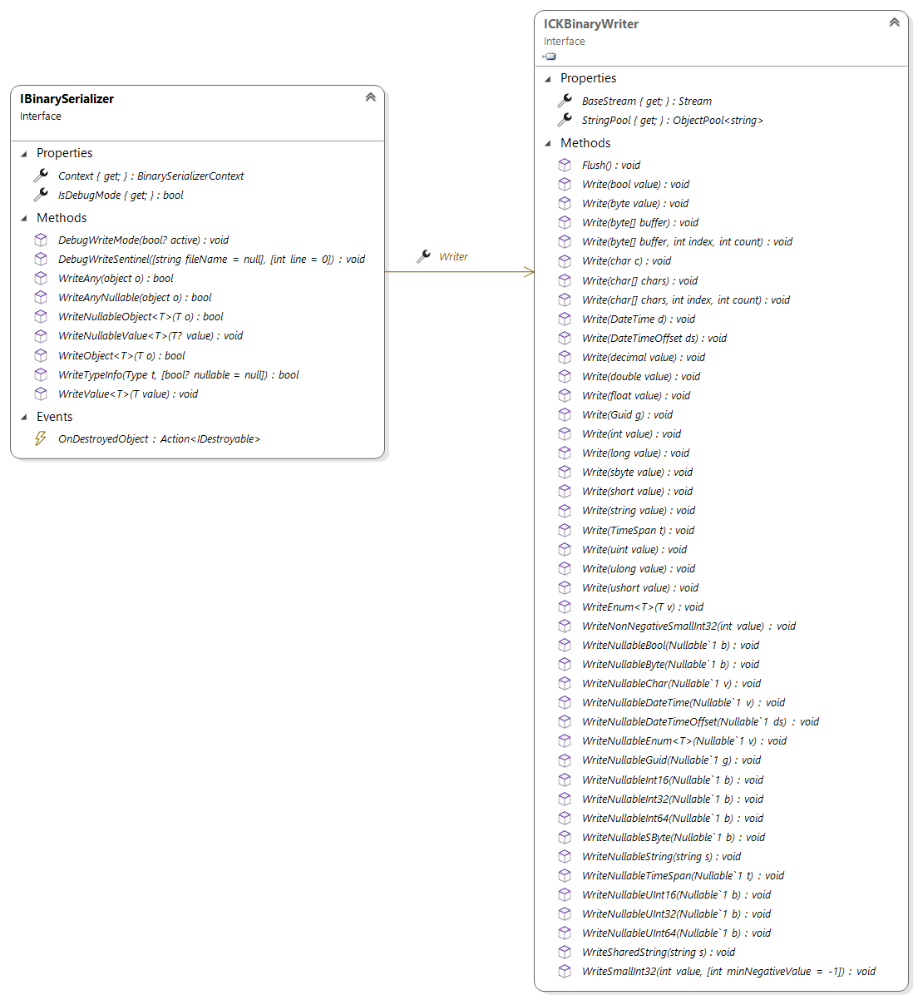

# CK-BinarySerializer

Yet another serialization library? Unfortunately yes...

## What matters: performance, immutability and type mutation
Performance matters and that's why this is all about schema-less, binary serialization. Binary serialization can be
highly efficient at the cost of some complexity and non readability.

Immutability is a very important concept that basically relies on `readonly` fields. This why we only consider here
deserialization constructors since constructors are the only clean way to restore read only fields and properties.

The third and most important aspect is that serialization must not prevent the code base to evolve. The architecture
of this library is primarily driven by this concern. 

(This is not yet finalized.)

## Writing is not Reading

Just like with CQRS, serialization cannot be handled exactly like deserialization. There's always one way to 
serialize an instance of a type: the instance's state must be serialized and the code to serialize an instance
depends solely on the instance's type. 

Deserialization is less obvious: 
 - the serialized type may have been renamed, moved to another namespace or even to another assembly.
 - the serialized instance is an old one: the current shape of its state is not the same as the serialized one. 
   what was a field is now a property, a new Power property exists, the field __age_ that was an integer is now a double.

This library is totally schizophrenic: there are Serializers on one side and Deserializers on another and they 
are quite different beasts. They, of course, work together and the high level API looks similar but _how they work_ differs. 

## High level API: Serializer, Deserializer, Context and SharedContext

### The [IBinarySerializer](CK.BinarySerialization/Serialization/IBinarySerializer.cs)

To serialize a graph of objects, a `IDisposableBinarySerializer` must first be obtained thanks to `BinarySerializer.Create`
factory method that takes a Stream and a Context.

> [BinarySerializer](CK.BinarySerialization/Serialization/BinarySerializer.cs) and [BinaryDeserializer](CK.BinarySerialization/Deserialization/BinaryDeserializer.cs)
> are purely static classes.

This serializes 2 lists. (Note that a User may reference one or more Books here, any references among these objects
will be preserved and restored.)
```c#
var stream = new MemoryStream();
List<User> users = GetAllUsers();
IReadOnlyList<Book> books = GetAllBooks();
using( var s = BinarySerializer.Create( stream, new BinarySerializerContext() ) )
{
  s.WriteObject( users );
  s.WriteObject( books );
}
```
This serializer must be disposed once done with it: this ends the serialization session and release the Context.
This Context is a cache that can be reused for another (non concurrent) serialization session: the association
between a Type to serialize and its serializer is cached in a simple dictionary and subsequent runs are definitely faster.

### The [IBinaryDeserializer](CK.BinarySerialization/Deserialization/IBinaryDeserializer.cs)

Deserialization uses another pattern: a function must do the job. Here, since we must read back the 2 lists, we return
a value tuple with the 2 lists.
```c#
// The stream must be correctly positioned.
stream.Position = 0;
var result = BinaryDeserializer.Deserialize( stream, new BinaryDeserializerContext(), d =>
{
  return (d.ReadObject<List<User>>(), d.ReadObject<IReadOnlyList<Book>>());
} );
Debug.Assert( result.IsValid );
Debug.Assert( result.Error == null );

var (users,books) = result.GetResult();
```
> We could also have used a closure on local variables and an `Action<IBinaryDeserializer>`
instead of the `Func<IBinaryDeserializer, T>` deserializer function but using a value tuple here is
cleaner.

Here also the `new BinaryDeserializerContext()` can be kept and reused to significantly boost subsequent
deserialization sessions.

### The Contexts and SharedContexts
[BinarySerializerContext](CK.BinarySerialization/Serialization/BinarySerializerContext.cs)
and [BinaryDeserializerContext](CK.BinarySerialization/Deserialization/BinaryDeserializerContext.cs) are simple
non concurrent caches that can be reused to avoid recomputing Type to [ISerializationDriver](CK.BinarySerialization/Serialization/Abstractions/ISerializationDriver.cs)
and [ITypeReadInfo](CK.BinarySerialization/Deserialization/TypeReadInfo/ITypeReadInfo.cs) to [IDeserializationDriver](CK.BinarySerialization/Deserialization/Abstractions/IDeserializationDriver.cs)
mappings.

The `BinaryDeserializerContext` can also capture a `IServiceProvider` that can be used by deserializers to "rebind" the
deserialized objects to any external services (or other contextual objects) if needed.

These are only caches: mappings definition are managed by the thread safe [SharedBinarySerializerContext](CK.BinarySerialization/Serialization/Registries/SharedBinarySerializerContext.cs)
and [SharedBinaryDeserializerContext](CK.BinarySerialization/Deserialization/Registries/SharedBinaryDeserializerContext.cs).

The shared contexts choose the appropriate drivers (they respectively implement [ISerializerResolver](CK.BinarySerialization/Serialization/Abstractions/ISerializerResolver.cs)
and [IDeserializerResolver](CK.BinarySerialization/Deserialization/Abstractions/IDeserializerResolver.cs)) and can be
configured to handle singletons, new types and type mutations.

The default shared contexts are exposed by static properties of `BinarySerializer` and `BinaryDeserializer`:

```c#
public static class BinarySerializer
{
    /// <summary>
    /// Gets the default thread safe static context initialized with the <see cref="BasicTypeSerializerRegistry.Instance"/>,
    /// <see cref="SimpleBinarySerializableFactory.Instance"/> and a <see cref="StandardGenericSerializerFactory"/>
    /// deserializer resolvers and <see cref="SharedSerializerKnownObject.Default"/>.
    /// </summary>
    public static readonly SharedBinarySerializerContext DefaultSharedContext = new SharedBinarySerializerContext();

    ...
}

public static class BinaryDeserializer
{
    /// <summary>
    /// Gets the default thread safe static registry of <see cref="IDeserializerResolver"/>.
    /// </summary>
    public static readonly SharedBinaryDeserializerContext DefaultSharedContext;

    ...
}
```

### Handling "true" singletons

How do you serialize [DBNull.Value](https://docs.microsoft.com/en-us/dotnet/api/system.dbnull)?
Or [StringComparer.OrdinalIgnoreCase](https://docs.microsoft.com/en-us/dotnet/api/system.stringcomparer.ordinalignorecase)?

This is a more complex issue than it may appear. CK.BinarySerialization implements a basic answer by allowing to give a
name to these objects.

[SharedSerializerKnownObject](CK.BinarySerialization/Serialization/Registries/SharedSerializerKnownObject.cs) and
[SharedDeserializerKnownObject](CK.BinarySerialization/Deserialization/Registries/SharedDeserializerKnownObject.cs)
both expose a static `Default` property that can be used to register these "known objects".

By default, the following singletons are registered: `DBNull.Value`, `Type.Missing`, `StringComparer.Ordinal`,
`StringComparer.OrdinalIgnoreCase`, `StringComparer.InvariantCulture`, `StringComparer.InvariantCultureIgnoreCase`,
`StringComparer.CurrentCulture`,`StringComparer.CurrentCultureIgnoreCase`.

This is not perfect but it works.

### Supporting new types
Any type can be serialized thanks to dedicated Serializers and Deserializers that can be registered in the shared contexts.

For a simple (but potentially recursive) class like this one:
```c#
  class Node
  {
      public string? Name { get; set; }

      public Node? Parent { get; set; }
  }
```
Its serializer is a `ReferenceTypeSerializer<Node>`. The `DriverName` must be unique (but can be any string),
the `SerializationVersion` typically starts at 0 and must be incremented whenever the binary layout changes:
```c#
  sealed class NodeSerializer : ReferenceTypeSerializer<Node>
  {
      public override string DriverName => "Node needs Node!";

      public override int SerializationVersion => 0;

      protected override void Write( IBinarySerializer s, in Node o )
      {
          s.Writer.WriteNullableString( o.Name );
          s.WriteNullableObject( o.Parent );
      }
  }
```
The `ReferenceTypeDeserializer<Node>` is even simpler:
```c#
  sealed class NodeDeserializer : ReferenceTypeDeserializer<Node>
  {
      protected override void ReadInstance( ref RefReader r )
      {
          Debug.Assert( r.ReadInfo.Version == 0 );
          var n = new Node();
          var d = r.SetInstance( n );
          n.Name = r.Reader.ReadNullableString();
          n.Parent = d.ReadNullableObject<Node>();
      }
  }
```
Registering these deserializer and serializer in the default shared contexts must be obviously done
before any de/serialization, typically in a type initializer (a Type's static constructor):
```c#
BinarySerializer.DefaultSharedContext.AddSerializationDriver( typeof( Node ), new NodeSerializer() );
BinaryDeserializer.DefaultSharedContext.AddLocalTypeDeserializer( new NodeDeserializer() );
``` 

### Simple mutations: renaming Types

The capability to rename types is crucial, may be even more important than handling struct/class mutations.
Bad naming happens often and serialization should not block the process of choosing a better name for things.

The code below handles a `Domain` to `ODomain` and `Coordinator` to `OCoordinatorRoot` renaming.

```c#
  static CoordinatorClient()
  {
      BinaryDeserializer.DefaultSharedContext.AddDeserializationHook( t =>
      {
          if( t.WrittenInfo.TypeNamespace == "CK.Observable.League" )
          {
              if( t.WrittenInfo.TypeName == "Domain" )
              {
                  t.SetTargetType( typeof( ODomain ) );
              }
              else if( t.WrittenInfo.TypeName == "Coordinator" )
              {
                  t.SetTargetType( typeof( OCoordinatorRoot ) );
              }
          }
      } );
  }
```

The shared deserialization context must register such deserialization hooks before any serialization occur:
here we've used the type initializer of the Type that is in charge of serializing and deserializing these
objects.

> Note that once you're assured that any files or serialized streams that may exist with the old naming have 
> been rewritten at least once, the hook can (and should) be removed.

## Nullable handling is currently partial

Nullable value types like `int?` (`Nullable<int>`) are serialized with a marker byte and then the value itself if it is not null. 
Nullable value types are easy: the types are not the same. It's unfortunately much more subtle for reference types: A `User?` is 
exactly of the same type as `User`, the difference is in the way you use it in your code.

The kernel is able to fully support Nullable Reference Type: a `List<User>` will actually be serialized the same way 
as a `List<User?>`: a reference type instance always require an extra byte that can handle an already deserialized reference
vs. a new (not seen yet) instance. Note that this byte marker is also used for the `null` value for nullable reference type
(and we cannot avoid it). 

As of today, CK.BinarySerialization considers all reference types as being potentially null (this is called the "oblivious nullable context",
with one exception: the key of a `Dictionary<TKey,TValue>` that is assumed to be not nullable.

Since the binary layout of reference types always require a byte to handle potential references and that nullable value types are not the 
same as their regular type, full support of NRT will have no real impact on the size or the performance... Its real objective
is related to mutation support. Current partial NRT support makes today mutation from class to struct to actually be class to nullable
struct mutation. This is discussed in more details below.

The plan regarding full NRT support is to:
- Extract the NullableTypeTree from CK.CodeGen.
- Improves it with new features of .net 6 that helps discovering nullabilities of generic parameters.
- Use it here to fully exploit the NRT.

## IBinarySerializer and ICKBinaryWriter, IBinaryDeserializer and ICKBinaryReader

The `ICKBinaryWriter` and `ICKBinaryReader` are defined and implemented by `CKBinaryWriter`
and `CKBinaryReader` in CK.Core. They specialize the .Net System.IO.BinaryReader/Writer classes
and provides an enriched API that reads/writes basic types like `Guid` or `DateTimeOffset` and support
nullable value types once for all.

Those are basic APIs. The CK.BinarySerialization.IBinarySerializer/Deserializer supports objects
serialization (object reference tracking, struct/class neutrality and versioning) but relies
on the basic Reader/Writer (and expose them).



Recommended conventions are:
- Serializer is **s**: `IBinarySerializer s`
- Writer is **w**: `ICKBinaryWriter w`
- Deserializer is **d**: `IBinaryDeserializer d`
- Reader is **r**: `ICKBinaryReader r`

## Basic serialization: CK.Core ICKSimpleBinarySerializable and ICKVersionedBinarySerializable

CK.Core package can handle "simple serializable".
See [here](https://github.com/Invenietis/CK-Core/tree/develop/CK.Core/SimpleSerialization).

The BinarySerializer is not required for these 2 kind of serializable objects. Everything is available 
from CK.Core: the `CK.Core.ICKBinaryReader` and `CK.Core.ICKBinaryWriter` interfaces and their 
respective default implementations can be used without the CK.BinarySerialization package.

This package offers a much more comprehensive support of binary serialization but handles automatically
the objects that are "simple serializable".

## ICKSlicedBinarySerializable (any type)
The `CK.BinarySerialization.ICKSlicedSerializable` interface is a pure marker interface:
```c#
    /// <summary>
    /// Marker interface for types that can use the "Sliced" serialization. 
    /// </summary>
    public interface ICKSlicedSerializable
    {
    }
```

This interface implies that the type must be decorated with the SerializationVersion attribute, exposes a deserialization constructor,
a `public static Write` method (and, if the class is not sealed, a special empty deserialization constructor to be called by specialized types). 
Below is a typical base class implementation (`IsDestroyed` property is discussed below):

```c#
[SerializationVersion(0)]
public class Person : ICKSlicedSerializable, IDestroyable
{
    // ...

    protected Person( Sliced _ ) { }

    public Person( IBinaryDeserializer d, ITypeReadInfo info )
    {
        IsDestroyed = d.Reader.ReadBoolean();
        Name = d.Reader.ReadNullableString();
        if( !IsDestroyed )
        {
            Friends = d.ReadObject<List<Person>>();
            Town = d.ReadObject<Town>();
        }
    }

    public static void Write( IBinarySerializer s, in Person o )
    {
        s.Writer.Write( o.IsDestroyed );
        s.Writer.WriteNullableString( o.Name );
        if( !o.IsDestroyed )
        {
            s.WriteObject( o.Friends );
            s.WriteObject( o.Town );
        }
    }
}
```
The base class **must** be marked with `ICKSlicedSerializable`:

Below is a non sealed specialization of this base class:
```c#
[SerializationVersion(0)]
public class Employee : Person
{
    // ...

    protected Employee( Sliced _ ) : base( _ ) { }

    public Employee( IBinaryDeserializer d, ITypeReadInfo info )
        : base( Sliced.Instance )
    {
        BestFriend = d.ReadNullableObject<Employee>();
        EmployeeNumber = d.Reader.ReadInt32();
        Garage = d.ReadObject<Garage>();
    }

    public static void Write( IBinarySerializer s, in Employee o )
    {
        s.WriteNullableObject( o.BestFriend );
        s.Writer.Write( o.EmployeeNumber );
        s.WriteObject( o.Garage );
    }
}
```

The `IDestroyable` interface is a minimalist interface:

```c#
    /// <summary>
    /// Optional interface that exposes a <see cref="IsDestroyed"/> property that can be implemented 
    /// by reference types that have a "alive" semantics (they may be <see cref="IDisposable"/> but this 
    /// is not required).
    /// <para>
    /// <see cref="IBinarySerializer.OnDestroyedObject"/> event is raised whenever a destroyed object
    /// is written: this supports tracking of "dead" objects in serialized graphs.
    /// </para>
    /// <para>
    /// When used with "sliced serializable", this must be implemented at the root of the serializable
    /// hierarchy and automatically skips calls to specialized Write methods and deserialization constructors.
    /// </para>
    /// <para>
    /// Only reference types are supported: implementing this interface on value type is ignored.
    /// </para>
    /// </summary>
    public interface IDestroyable
    {
        /// <summary>
        /// Gets whether this object has been disposed.
        /// </summary>
        bool IsDestroyed { get; }
    }
```
As the comment states, a destroyed instance is "optimized" by the serializer since only the root Write/Deserialization
constructor is called, specialized ones are skipped (this is why `Employee` doesn't need to handle it). 

## Automatic mutations supported

Only a few mutations are currently supported, they are detailed below.

However the objective is be able to transparently handle mutations:
- From non nullable to nullable types for value as well as reference types: this should be handled automatically 
  and is always safe.
- From nullable to non nullable types for value as well as reference types: this MAY be handled automatically 
  but we are still thinking about it since this not "safe by design": some serialized data that __happens__ to have 
no null values will work whereas another one will fail miserably or worst(?), for value types, default values will 
"magically" appear in place of their previous null.
- Between `List<T>`, `T[]`, `Queue<T>` (and may be others).
- Between Tuple and ValueTuple.
- etc.

### Enum
Enums can change their underlying type freely:
```c#
public enum Status : byte { ... }
```
Can become:
```c#
public enum Status : ushort { ... }
```
As long as the old integral type can be converted at runtime to the new one, this is transparent. At runtime means that 
the actual values are converted, regardless of the underlying type wideness. The below mutation will work:
```c#
public enum Status : long { None = 0, On = 1, Off = 2, White = 4, OutOfRange = -5, OutOfOrder = 3712 }
```
Can become:
```c#
public enum Status : short { None = 0, On = 1, Off = 2, White = 4, OutOfRange = -5, OutOfOrder = 3712 }
```
Since all values fit in a `short` (`Int16`), everything's fine. 

The risk here is to downsize the underlying type, removing or changing the values that don't fit in the new one, forgetting
that you did this and reloading an old serialized stream that contains these out of range values: an `OverflowException` will
be raised.

**Important:** 
Underlying type mutation will work ONLY when using `IBinarySerializer.WriteValue<T>(in T)` and 
`IBinaryDeserializer.ReadValue<T>()`.
Using the `ICKBinaryWriter.WriteEnum<T>(T)` and `ICKBinaryReader.ReadEnum<T>` CANNOT handle such migrations, but they 
can be done easily:
```c#
    /// Status was a long in version 1, we are now in version 2 and this is now a short.
    if( info.Version < 2 )
    {
        MyStatus = (Status)(short)d.Reader.ReadInt64();
    }
    else
    {
        MyStatus = d.Reader.ReadEnum<Status>();
    }
```
> `ICKBinaryWriter.WriteEnum<T>(T)` and `ICKBinaryReader.ReadEnum<T>` will be deprecated soon. They are not efficient
> and should be replaced by writing and reading the base type of the enum and simply casting it just as in the example above.


## General support of struct to class and class to (nullable!) struct mutations

This simply works for struct to class: each serialized struct becomes a new object. The 2 possible 
base classes for reference type ([`ReferenceTypeDeserializer<T>`](CK.BinarySerialization/Deserialization/Deserializer/ReferenceTypeDeserializer.cs) 
and [`SimpleReferenceTypeDeserializer<T>`](CK.BinarySerialization/Deserialization/Deserializer/SimpleReferenceTypeDeserializer.cs)) directly 
supports this mutation.

Transforming a class into a struct is more complex because a serialized reference type is written 
only once (subsequent references are written as simple numbers). The efficient value type deserializer 
[`ValueTypeDeserializer<T>`](CK.BinarySerialization/Deserialization/Deserializer/ValueTypeDeserializer.cs) is not able to handle
this mutation. When a serialized stream that has been written with classes must be read back, 
the [`ValueTypeDeserializerWithRef<T>`](CK.BinarySerialization/Deserialization/Deserializer/ValueTypeDeserializerWithRef.cs)
must be used.

Another aspect to consider is, because of the current partial NRT support, that a class is nullable by default ("oblivious context"). So 
we are stuck today to "class to nullable struct" mutation: a `List<Car>` (where `Car` is a class) must be a `List<Car?>` when `Car` 
becomes a struct since we don't currently analyze the actual type "in depth".

And the cherry on the cake of class to struct mutation complexity is when the serialized class has been chosen to break a 
too deep recursion: 
- its data has not been written at its first occurrence but later (when the stack is emptied)...
- so we cannot read its value right now for its first need (and memorize it for its subsequent occurrences)...
- so there's at least one value property that is "unitialized" in the graph...
- so the whole graph is de facto invalid!

This is the very reason of the potential second pass on the stream: if we have no luck and a class that is being transformed into a struct 
has been chosen to break the serializer's recursion, we forget the whole graph at the end and read it again... except that during the first
pass these problematic values have been enqueued in a special queue and the second pass dequeues these values at their first occurrences:
the final second graph is valid.  

The 3 types of serializations handle these mutations automatically: special deserialization drivers are synthesized when 
such mutation are detected.
