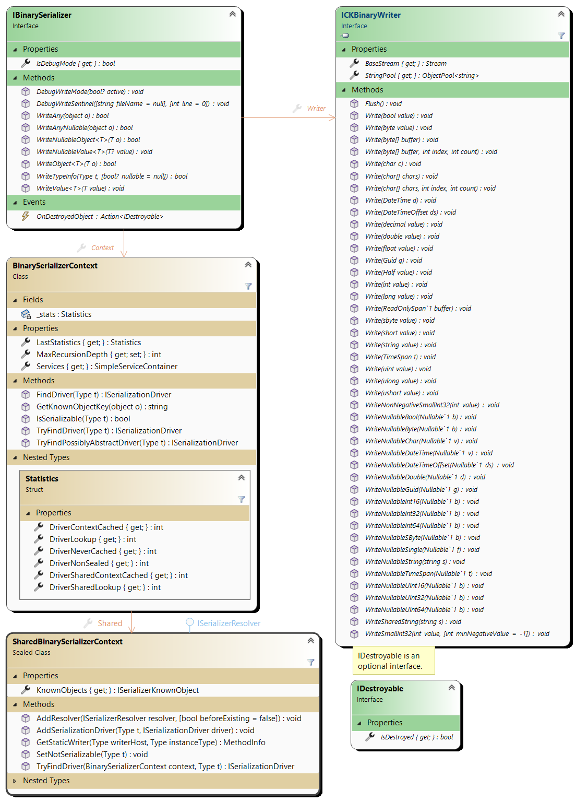

# CK-BinarySerializer

Yet another serialization library? Unfortunately yes...

## What matters: performance, immutability and type mutation
Performance matters and that's why this is all about schema-less, binary serialization. Binary serialization can be
highly efficient at the cost of some complexity and non readability.

Immutability is a very important concept that basically relies on `readonly` fields. This why we only consider here
deserialization constructors since constructors are the only clean way to restore read only fields and properties.

The third and most important aspect is that serialization must not prevent the code base to evolve. The architecture
of this library is primarily driven by this concern. 

(This is not yet finalized.)

## Writing is not Reading

Just like with CQRS, serialization cannot be handled exactly like deserialization. There's always one way to 
serialize an instance of a type: the instance's state must be serialized and the code to serialize an instance
depends solely on the instance's type. 

Deserialization is less obvious: 
 - the serialized type may have been renamed, moved to another namespace or even to another assembly.
 - the serialized instance is an old one: the current shape of its state is not the same as the serialized one. 
   what was a field is now a property, a new Power property exists, the field __age_ that was an integer is now a double.

This library is totally schizophrenic: there are Serializers on one side and Deserializers on another and they 
are quite different beasts. They, of course, work together and the high level API looks similar but _how they work_ differs. 

## High level API: Serializer, Deserializer, Context and SharedContext

### The [IBinarySerializer](CK.BinarySerialization/Serialization/IBinarySerializer.cs)

To serialize a graph of objects, a `IDisposableBinarySerializer` must first be obtained thanks to `BinarySerializer.Create`
factory method that takes a Stream and a Context.

> [BinarySerializer](CK.BinarySerialization/BinarySerializer.cs) and [BinaryDeserializer](CK.BinarySerialization/BinaryDeserializer.cs)
> are purely static classes.

This serializes 2 lists. (Note that a User may reference one or more Books here, any references among these objects
will be preserved and restored.)
```csharp
var stream = new MemoryStream();
List<User> users = GetAllUsers();
IReadOnlyList<Book> books = GetAllBooks();
using( var s = BinarySerializer.Create( stream, new BinarySerializerContext() ) )
{
  s.WriteObject( users );
  s.WriteObject( books );
}
```
This serializer must be disposed once done with it: this ends the serialization session and release the Context.
This Context is a cache that can be reused for another (non concurrent) serialization session: the association
between a Type to serialize and its serializer is cached in a simple dictionary and subsequent runs are definitely faster.

### The [IBinaryDeserializer](CK.BinarySerialization/Deserialization/IBinaryDeserializer.cs)

Deserialization uses another pattern: a function must do the job. Here, since we must read back the 2 lists, we return
a value tuple with the 2 lists.
```csharp
// The stream must be correctly positioned.
stream.Position = 0;
var result = BinaryDeserializer.Deserialize( stream, new BinaryDeserializerContext(), d =>
{
  return (d.ReadObject<List<User>>(), d.ReadObject<IReadOnlyList<Book>>());
} );
Debug.Assert( result.IsValid );
Debug.Assert( result.Error == null );

var (users,books) = result.GetResult();
```
> We could also have used a closure on local variables and an `Action<IBinaryDeserializer>`
instead of the `Func<IBinaryDeserializer, T>` deserializer function but using a value tuple here is
cleaner.

Here also the `new BinaryDeserializerContext()` can be kept and reused to significantly boost subsequent
deserialization sessions.

### The Contexts and SharedContexts
[BinarySerializerContext](CK.BinarySerialization/Serialization/BinarySerializerContext.cs)
and [BinaryDeserializerContext](CK.BinarySerialization/Deserialization/BinaryDeserializerContext.cs) are simple
non concurrent caches that can be reused to avoid recomputing Type to [ISerializationDriver](CK.BinarySerialization/Serialization/Abstractions/ISerializationDriver.cs)
and [ITypeReadInfo](CK.BinarySerialization/Deserialization/TypeReadInfo/ITypeReadInfo.cs) to [IDeserializationDriver](CK.BinarySerialization/Deserialization/Abstractions/IDeserializationDriver.cs)
mappings and expose a `IServiceProvider`. De/Serialization can rely on available services.
Deserializers can "rebind" the deserialized objects to any external services (or other contextual objects) if needed.


These contexts are only caches: mappings definition are managed by the thread safe [SharedBinarySerializerContext](CK.BinarySerialization/Serialization/SharedBinarySerializerContext.cs)
and [SharedBinaryDeserializerContext](CK.BinarySerialization/Deserialization/SharedBinaryDeserializerContext.cs) that use Resolvers
([ISerializerResolver](CK.BinarySerialization/Serialization/Abstractions/ISerializerResolver.cs)
and [IDeserializerResolver](CK.BinarySerialization/Deserialization/Abstractions/IDeserializerResolver.cs)) and can be
configured to handle singletons, new types and type mutations.

The default shared contexts are exposed by static properties of `BinarySerializer` and `BinaryDeserializer`:

```csharp
public static class BinarySerializer
{
    /// <summary>
    /// Gets the default thread safe static context initialized with the <see cref="BasicTypesSerializerResolver.Instance"/>,
    /// <see cref="SimpleBinarySerializerResolver.Instance"/> and a <see cref="StandardGenericSerializerResolver"/>
    /// deserializer resolvers and <see cref="SharedSerializerKnownObject.Default"/>.
    /// <para>
    /// If the CK.BinarySerialization.IPoco or CK.BinarySerialization.Sliced assemblies can be loaded, then resolvers
    /// for <c>IPoco</c> and <c>ICKSlicedSerializable</c> are automatically registered.
    /// </para>
    /// </summary>
    public static readonly SharedBinarySerializerContext DefaultSharedContext = new SharedBinarySerializerContext();

    ...
}

public static class BinaryDeserializer
{
    /// <summary>
    /// Gets the default thread safe static context initialized <see cref="BasicTypesDeserializerResolver.Instance"/>,
    /// <see cref="SimpleBinaryDeserializerResolver.Instance"/>, a <see cref="StandardGenericDeserializerResolver"/>
    /// and <see cref="SharedDeserializerKnownObject.Default"/>.
    /// <para>
    /// If the CK.BinarySerialization.IPoco or CK.BinarySerialization.Sliced assemblies can be loaded, then resolvers
    /// for <c>IPoco</c> and <c>ICKSlicedSerializable</c> are automatically registered.
    /// </para>
    /// </summary>
    public static readonly SharedBinaryDeserializerContext DefaultSharedContext = new SharedBinaryDeserializerContext();;

    ...
}
```

### Handling "true" singletons

How do you serialize [DBNull.Value](https://docs.microsoft.com/en-us/dotnet/api/system.dbnull)?
Or [StringComparer.OrdinalIgnoreCase](https://docs.microsoft.com/en-us/dotnet/api/system.stringcomparer.ordinalignorecase)?

This is a more complex issue than it may appear. CK.BinarySerialization implements a basic answer by allowing to give a
name to these objects.

[SharedSerializerKnownObject](CK.BinarySerialization/Serialization/Resolvers/SharedSerializerKnownObject.cs) and
[SharedDeserializerKnownObject](CK.BinarySerialization/Deserialization/Resolvers/SharedDeserializerKnownObject.cs)
both expose a static `Default` property that can be used to register these "known objects".

By default, the following singletons are registered: `DBNull.Value`, `Type.Missing`, `StringComparer.Ordinal`,
`StringComparer.OrdinalIgnoreCase`, `StringComparer.InvariantCulture`, `StringComparer.InvariantCultureIgnoreCase`,
`StringComparer.CurrentCulture`,`StringComparer.CurrentCultureIgnoreCase`.

This is not perfect but it works.

### Supporting new types
#### Registering a Serializer and a Deserializer
Any type can be serialized thanks to dedicated Serializers and Deserializers that can be registered in the shared contexts.

For a simple (but potentially recursive) class like this one:
```csharp
  class Node
  {
      public string? Name { get; set; }

      public Node? Parent { get; set; }
  }
```
Its serializer is a `ReferenceTypeSerializer<Node>`. The `DriverName` must be unique (but can be any string),
the `SerializationVersion` typically starts at 0 and must be incremented whenever the binary layout changes:
```csharp
  sealed class NodeSerializer : ReferenceTypeSerializer<Node>
  {
      public override string DriverName => "Node needs Node!";

      public override int SerializationVersion => 0;

      protected override void Write( IBinarySerializer s, in Node o )
      {
          s.Writer.WriteNullableString( o.Name );
          s.WriteNullableObject( o.Parent );
      }
  }
```
The `ReferenceTypeDeserializer<Node>` is even simpler:
```csharp
  sealed class NodeDeserializer : ReferenceTypeDeserializer<Node>
  {
      protected override void ReadInstance( ref RefReader r )
      {
          Debug.Assert( r.ReadInfo.Version == 0 );
          var n = new Node();
          var d = r.SetInstance( n );
          n.Name = r.Reader.ReadNullableString();
          n.Parent = d.ReadNullableObject<Node>();
      }
  }
```
Registering these deserializer and serializer in the appropriate shared contexts (quite always the default ones)
must be obviously done before any de/serialization. For default shared context, this is typically done in a type
initializer (a Type's static constructor):
```csharp
BinarySerializer.DefaultSharedContext.AddSerializationDriver( typeof( Node ), new NodeSerializer() );
BinaryDeserializer.DefaultSharedContext.AddDeserializerDriver( new NodeDeserializer() );
``` 
The type to handle must NOT already be associated to an existing driver otherwise an `InvalidOperationException` is
thrown.

These explicitly registered drivers take precedence over the ones that may be resolved by resolvers.

#### Registering Resolvers
Serialization and deserialization drivers handle a specific Type. This is not enough for "Type families" like a "User" base
class that can be specialized of for generic types like a `Container<T1,T2>`. To handle such polymorphic types,
([ISerializerResolver](CK.BinarySerialization/Serialization/Abstractions/ISerializerResolver.cs)
and [IDeserializerResolver](CK.BinarySerialization/Deserialization/Abstractions/IDeserializerResolver.cs)) can
be used.

Resolvers have the responsibility to locate or synthesize Drivers and handle type mutations.
They can be rather simple ([BasicTypesSerializerResolver](CK.BinarySerialization/Serialization/Resolvers/BasicTypesSerializerResolver.cs))
or quite complex ([StandardGenericDeserializerResolver](CK.BinarySerialization/Deserialization/Resolvers/StandardGenericDeserializerResolver.cs)).

Deserialization resolvers are nearly always more complex than their serialization counterpart.

## IBinarySerializer and ICKBinaryWriter, IBinaryDeserializer and ICKBinaryReader

The `ICKBinaryWriter` and `ICKBinaryReader` are defined and implemented by `CKBinaryWriter`
and `CKBinaryReader` in CK.Core. They extend the .Net System.IO.BinaryReader/Writer classes
and provides an enriched API that reads/writes basic types like `Guid` or `DateTimeOffset` and support
nullable value types once for all.

Those are basic APIs. The CK.BinarySerialization.IBinarySerializer/Deserializer supports objects
serialization (object reference tracking, struct/class neutrality and versioning) but relies
on the basic Reader/Writer (and expose them).



Recommended conventions are:
- Serializer is **s**: `IBinarySerializer s`
- Writer is **w**: `ICKBinaryWriter w`
- Deserializer is **d**: `IBinaryDeserializer d`
- Reader is **r**: `ICKBinaryReader r`

### Basic serialization: CK.Core ICKSimpleBinarySerializable and ICKVersionedBinarySerializable

CK.Core package can handle "simple serializable".
See [here](https://github.com/Invenietis/CK-Core/tree/develop/CK.Core/SimpleSerialization).

The BinarySerializer is not required for these 2 kind of serializable objects. Everything is available 
from CK.Core: the `CK.Core.ICKBinaryReader` and `CK.Core.ICKBinaryWriter` interfaces and their 
respective default implementations can be used without the CK.BinarySerialization package.

However,this CK.BinarySerialization package offers a much more comprehensive support of binary serialization
thanks to is resolvers and drivers (and handles automatically the objects that are "simple serializable") 
and thanks to the CK.BinarySerialization.Sliced package that exposes and handles a third marker interface
`ICKSlicedBinarySerializable`.

## CK.BinarySerialization.Sliced package for any type
The `CK.BinarySerialization.ICKSlicedSerializable` interface is a pure marker interface:
```csharp
    /// <summary>
    /// Marker interface for types that can use the "Sliced" serialization. 
    /// </summary>
    public interface ICKSlicedSerializable
    {
    }
```

This interface implies that the type must be decorated with the `SerializationVersion` attribute just like
the `CK.Core.ICKVersionedBinarySerializable` but "Sliced" serialization can be applied to any type
(whereas the `ICKVersionedBinarySerializable` is limited to sealed classes or structs).

Each sliced serializable type must expose a deserialization constructor, and a `public static Write` method
(and, if the class is not sealed, a special empty deserialization constructor to be called by specialized types). 

The "Sliced" serialization supports versioned classes specializations: a base class (abstract or simply not sealed)
can evolve freely without any impact on its potential specialization.

Below is a typical base class implementation (`IsDestroyed` property is discussed below):

```csharp
[SerializationVersion(0)]
public class Person : ICKSlicedSerializable, IDestroyable
{
    // ...

    protected Person( Sliced _ ) { }

    public Person( IBinaryDeserializer d, ITypeReadInfo info )
    {
        IsDestroyed = d.Reader.ReadBoolean();
        Name = d.Reader.ReadNullableString();
        if( !IsDestroyed )
        {
            Friends = d.ReadObject<List<Person>>();
            Town = d.ReadObject<Town>();
        }
    }

    public static void Write( IBinarySerializer s, in Person o )
    {
        s.Writer.Write( o.IsDestroyed );
        s.Writer.WriteNullableString( o.Name );
        if( !o.IsDestroyed )
        {
            s.WriteObject( o.Friends );
            s.WriteObject( o.Town );
        }
    }
}
```
The base class **must** be marked with `ICKSlicedSerializable`:

Below is a non sealed specialization of this base class:
```csharp
[SerializationVersion(0)]
public class Employee : Person
{
    // ...

    protected Employee( Sliced _ ) : base( _ ) { }

    public Employee( IBinaryDeserializer d, ITypeReadInfo info )
        : base( Sliced.Instance )
    {
        BestFriend = d.ReadNullableObject<Employee>();
        EmployeeNumber = d.Reader.ReadInt32();
        Garage = d.ReadObject<Garage>();
    }

    public static void Write( IBinarySerializer s, in Employee o )
    {
        s.WriteNullableObject( o.BestFriend );
        s.Writer.Write( o.EmployeeNumber );
        s.WriteObject( o.Garage );
    }
}
```

The `IDestroyable` interface is a minimalist interface:

```csharp
    /// <summary>
    /// Optional interface that exposes a <see cref="IsDestroyed"/> property that can be implemented 
    /// by reference types that have a "alive" semantics (they may be <see cref="IDisposable"/> but this 
    /// is not required).
    /// <para>
    /// <see cref="IBinarySerializer.OnDestroyedObject"/> event is raised whenever a destroyed object
    /// is written: this supports tracking of "dead" objects in serialized graphs.
    /// </para>
    /// <para>
    /// When used with "sliced serializable", this must be implemented at the root of the serializable
    /// hierarchy and automatically skips calls to specialized Write methods and deserialization constructors.
    /// </para>
    /// <para>
    /// Only reference types are supported: implementing this interface on value type is ignored.
    /// </para>
    /// </summary>
    public interface IDestroyable
    {
        /// <summary>
        /// Gets whether this object has been disposed.
        /// </summary>
        bool IsDestroyed { get; }
    }
```
As the comment states, a destroyed instance is "optimized" by the serializer since only the root Write/Deserialization
constructor is called, specialized ones are skipped (this is why `Employee` doesn't need to handle it). 

## Type Mutations

Code refactoring should not be locked by serialization considerations. To support refactoring, this library
does its best to allow basic, automatic, mutations from what has been written/serialized to the current
code state and its Types.

Automatic Mutations are great but they are not magic: for structural changes, proper version number management
from the `[SerializationVersion]` attribute is required and, sometimes, the `IBinaryDeserializer.PostActions`
must be used to fix, adapt, the old data to its new schema. Terrific evolutions can be achieved with Versions and
post actions: they may need intermediate migration data structures (and a bit of creativity).

One can split the mutations between Global a Local ones with subordinated categories. For each of them,
we discuss below whether this can, and if yes should, be an "Automatic Mutation", a mutation that can be done
without the need to increment any version number. 

### Global Mutations

**Global Mutations** apply to the existence, the location or nature of Types. 
- Simple: 
  - Renaming a Type (including a change of its namespace). 
    - This can easily be done thanks to the Deserializer hooks.
  - Moving a Type from one assembly to another one. 
    - As above, Deserializer hooks do the job.
  - Changing a class into a struct or a struct into a class. 
    - This is automatically handled (not easily but this is implemented).
- Complex: 
  - Suppressing a Type.
    - This cannot be automatic since the binary layout of previous instances must be skipped. 
      This requires a version increment, the (deprecated) type code that reads the type and all
      calls to it must be kept for at least one version (the write code can be suppressed).
  - Splitting/merging of one or more Types into one or more Types.
    - There is absolutely no generic way to do this. For very complex migrations, you may even need 
      to introduce intermediate "key versions", that forget previous ones and "starts fresh" to limit
      code complexity.

#### Renaming Types

The capability to rename types is crucial, may be even more important than handling struct/class mutations.
Bad naming happens often and serialization should not block the process of choosing a better name for things.

The code below handles a `Domain` to `ODomain` and `Coordinator` to `OCoordinatorRoot` renaming.

```csharp
  static CoordinatorClient()
  {
      BinaryDeserializer.DefaultSharedContext.AddDeserializationHook( t =>
      {
          if( t.WrittenInfo.TypeNamespace == "CK.Observable.League" )
          {
              if( t.WrittenInfo.TypeName == "Domain" )
              {
                  t.SetTargetType( typeof( ODomain ) );
              }
              else if( t.WrittenInfo.TypeName == "Coordinator" )
              {
                  t.SetTargetType( typeof( OCoordinatorRoot ) );
              }
          }
      } );
  }
```

The shared deserialization context must register such deserialization hooks before any serialization occur:
here we've used the type initializer of the `CoordinatorClient` Type that is in charge of serializing and
deserializing these objects.

> Note that once you're assured that any files or serialized streams that may exist with the old naming have 
> been rewritten at least once, the hook can (and should) be removed.

#### Changing namespace or assembly

The code above shows the hook registration. The hook has access to a [IMutableTypeReadInfo](CK.BinarySerialization/Deserialization/TypeReadInfo/IMutableTypeReadInfo.cs).


This can be used to map the namespace and/or assembly by setting the assembly name, namespace or, more directly,
the TargetType that must be used.

### Local Mutations

**Local mutations** apply inside a Type. 
- Safe mutations are mutations that cannot fail.
  - Non nullable to nullable 
    - `int` that becomes a `int?`.
    - `List<(int,User)>` that becomes a `List<(int?,User?)>?`.
  - Numeric type to wider numeric type 
    - `byte` into `int` or `short` into `int`.
  - An enum into its underlying integral type.
  - An enum into an integral type wider than its underlying type.
  - Between list type containers: `List<T>`, `T[]` (array), `Stack<T>`

Those totally safe mutations are automatically handled. `Convert.ChangeType` is used
(that itself rely on `IConvertible`): some of these conversions can throw
an `OverflowException` (noted with a 'u' in the table below).

|From->To|Bool|Char|SByte|Byte|I16 |U16 |I32 |U32 |I64 |U64 |Sgl |Dbl |Dec |
|--------|----|----|-----|----|----|----|----|----|----|----|----|----|----|
|Boolean | .  |    | +   | +  | +  | +  | +  | +  | +  | +  | +  | +  | +  |
|Char    |    | .  | u   | u  | u  | +  | +  | +  | +  | +  |    |    |    |
|SByte   | +  | u  | .   | u  | +  | u  | +  | u  | +  | u  | +  | +  | +  |
|Byte    | +  | +  | u   | .  | +  | +  | +  | +  | +  | +  | +  | +  | +  |
|Int16   | +  | +  | u   | u  | .  | u  | +  | u  | +  | u  | +  | +  | +  |
|UInt16  | +  | +  | u   | u  | u  | .  | +  | +  | +  | +  | +  | +  | +  |
|Int32   | +  | u  | u   | u  | u  | u  | .  | +  | +  | +  | +  | +  | +  |
|UInt32  | +  | u  | u   | u  | u  | u  | u  | .  | +  | +  | +  | +  | +  |
|Int64   | +  | u  | u   | u  | u  | u  | u  | u  | .  | +  | +  | +  | +  |
|UInt64  | +  | u  | u   | u  | u  | u  | u  | u  | u  | .  | +  | +  | +  |
|Single  | +  |    | u   | u  | u  | u  | u  | u  | u  | u  | .  | +  | +  |
|Double  | +  |    | u   | u  | u  | u  | u  | u  | u  | u  | u  | .  | +  |
|Decimal | +  |    | u   | u  | u  | u  | u  | u  | u  | u  | u  | +  | .  |

- Unsafe mutations may fail at read time because the old data is incompatible with the new one.
  - Nullable to Non nullable value type. 
    - If a null is read one can throw an `InvalidDataException` or return the `default` value. 
      Changing the data to its default value is a dangerous option. Throwing is safer and the developer
      should use the versioning to safely read the old data.
    - Since we can check the read, this is an automatic mutation.  
  - Nullable to Non nullable reference type.
    - This should be the same as for value type: we should throw an `InvalidDataException`. Bad news
      is that this is not possible to detect the nullability of generics when used as method parameters...
      It means that we have no way to check that a `d.ReadObject<List<User>>()` MUST return a list without
      any null inside because for us, it is not distinguishable from a `d.ReadObject<List<User?>>()` call.
    - We are stuck here. Forbidding this mutation would _de facto_ forbids the safe `List<User>` to 
      `List<User?>` mutation... And we have no way to tell which is which: actually, we cannot forbid anything!
      Our only option is then to allow it. A deserialized graph MAY contain null references to "non nullable"
      instances. Alea jacta est.
  - Narrowing numeric types:
    - An `int` changed into a `byte` or a `long` to `double` MAY throw `OverflowException` and 
      this is "safe": we don't allow "dirty read".
      In doubt it's up to the developer to use versioning to safely read the old data.
    - Since we can check the read, this is an automatic mutation.  
  - An integral type into an enum.
      - This can easily be automatically handled. And it is but note that actual enum values are not checked. 
  - An enum type into another enum type.
      - This can easily be automatically handled. And it is. 
  - `HashSet<>` and `Dictionary<,>` 
    - There is a comparer to "invent" (from a list, stack or array) or to forget (when converting
      into list, stack or array). Changing any of these 2 types requires versioning. 
  - `Queue<>` 
    - Is not automatically mutated to list, stack or array because of ordering that is reversed
    and introduces an ambiguity: just like `HashSet<>`, it's up to the developer to
    deal with this through versioning.

#### Enum samples
Enums can change their underlying type freely:
```csharp
public enum Status : byte { ... }
```
Can become:
```csharp
public enum Status : ushort { ... }
```
As long as the old integral type can be converted at runtime to the new one, this is transparent. At runtime means that 
the actual values are converted, regardless of the underlying type wideness. The below mutation will work:
```csharp
public enum Status : long { None = 0, On = 1, Off = 2, White = 4, OutOfRange = -5, OutOfOrder = 3712 }
```
Can become:
```csharp
public enum Status : short { None = 0, On = 1, Off = 2, White = 4, OutOfRange = -5, OutOfOrder = 3712 }
```
Since all values fit in a `short` (`Int16`), everything's fine. 

The risk here is to downsize the underlying type, removing or changing the values that don't fit in the new one, forgetting
that you did this and reloading an old serialized stream that contains these out of range values: an `OverflowException` will
be raised.

**Important:** 
Underlying type mutation will work ONLY when using `IBinarySerializer.WriteValue<T>(in T)` and 
`IBinaryDeserializer.ReadValue<T>()`.
You can also choose to simply use casts between the enum type and its underlying type:
```csharp
    /// Status was a long in version 1, we are now in version 2 and this is now a short.
    if( info.Version < 2 )
    {
        MyStatus = (Status)(short)d.Reader.ReadInt64();
    }
    else
    {
        MyStatus = (Status)d.Reader.ReadInt16();
    }
```


## General considerations

### Nullable handling is "oblivious"

> Definitions from _Oxford Languages_: 
> __not aware of or concerned about what is happening around one.__
> _"She became absorbed, oblivious to the passage of time"_

Nullable value types like `int?` (`Nullable<int>`) are serialized with a marker byte and then the value itself if it is not null. 
Nullable value types are easy: the types are not the same. It's unfortunately much more subtle for reference types: A `User?` is 
exactly of the same type as `User`, the difference is in the way you use it in your code.

The kernel is able to fully support Nullable Reference Type: a `List<User>` will actually be serialized the same way 
as a `List<User?>`: a reference type instance always require an extra byte that can handle an already deserialized reference
vs. a new (not seen yet) instance. Note that this byte marker is also used for the `null` value for nullable reference type
(and we cannot avoid it). 

CK.BinarySerialization considers all reference types as being potentially null (this is called the "oblivious nullable context".
Full nullable reference type support is possible for properties, fields and regular method parameters, but not
in this API because of the use of generics method parameters for reading and writing).

And even if it was possible, the gain would be marginal: the binary layout of reference types always require
a byte to handle potential references and that byte is also used to denote a null reference: a full support of
NRT will have no impact on the size or the performance.

Its real objective would be safety, being able to throw an `InvalidDataException` instead of letting a null
be read in a "non nullable" reference.

### General support of struct to class and class to struct mutations

This simply works for struct to class: each serialized struct becomes a new object. The 2 possible 
base classes for reference type ([`ReferenceTypeDeserializer<T>`](CK.BinarySerialization/Deserialization/Implementation/ReferenceTypeDeserializer.cs) 
and [`SimpleReferenceTypeDeserializer<T>`](CK.BinarySerialization/Deserialization/Implementation/SimpleReferenceTypeDeserializer.cs)) directly 
supports this mutation.

Transforming a class into a struct is more complex because a serialized reference type is written 
only once (subsequent references are written as simple numbers). The efficient value type deserializer 
[`ValueTypeDeserializer<T>`](CK.BinarySerialization/Deserialization/Implementation/ValueTypeDeserializer.cs) is not able to handle
this mutation. When a serialized stream that has been written with classes must be read back, 
the [`ValueTypeDeserializerWithRef<T>`](CK.BinarySerialization/Deserialization/Implementation/ValueTypeDeserializerWithRef.cs)
must be used.

The cherry on the cake of class to struct mutation complexity is when the serialized class has been chosen to break a 
too deep recursion: 
- its data has not been written at its first occurrence but later (when the stack is emptied)...
- so we cannot read its value right now for its first need (and memorize it for its subsequent occurrences)...
- so there's at least one value property that is "unitialized" in the graph...
- so the whole graph is de facto invalid!

This is the very reason of the potential second pass on the stream: if we have no luck and a class that is being transformed into a struct 
has been chosen to break the serializer's recursion, we forget the whole graph at the end and read it again... except that during the first
pass these problematic values have been enqueued in a special queue and the second pass dequeues these values at their first occurrences:
the final second graph is valid.  

The 3 types of serializations handle these mutations automatically: special deserialization drivers are synthesized when 
such mutation are detected.
